# Ansible Architecture & Defense Master Guide

This guide documents the complete technical concepts, variable precedence hierarchy, and Q&A justifications for the Ansible hardening pipeline.

---

## 1. Core Ansible Architecture & Engine Setup

```text
ansible/
├── ansible.cfg              <-- Global Engine Configuration
├── requirements.yml         <-- Galaxy Role Dependencies
├── inventory/
│   └── hosts                <-- Dynamic Server IP Mapping
├── group_vars/
│   ├── all.yml              <-- Precedence Level 1 (Global Defaults)
│   └── vault.yml            <-- Encrypted Secrets (AES256)
├── roles/
│   └── RHEL10-CIS/          <-- Downloaded CIS Hardening Role
└── playbook.yml             <-- Precedence Level 2 (Playbook & Pre-Tasks)
```

### Key Components:
- **`ansible.cfg`**:
  - `host_key_checking = False`: Bypasses SSH `yes/no` fingerprint verification prompts, preventing automated CI/CD runs from freezing.
  - `inventory = inventory/hosts`: Sets default inventory path so commands don't require `-i` flags.
- **`inventory/hosts`**:
  - `[all]`: Brackets `[]` define a group name. Naming the group `[all]` automatically triggers Ansible to load `group_vars/all.yml`.
  - `[all:vars]`: Sets group-wide connection parameters (`ansible_user=root`, SSH key paths).

---

## 2. The 3-Tier Variable Precedence Hierarchy

Ansible resolves variable conflicts by evaluating priority tiers. Lower-numbered levels are overridden by higher-numbered levels:

```mermaid
gantt
    title Ansible Precedence Resolution (Weakest to Strongest)
    dateFormat X
    axisFormat %s
    section Precedence Hierarchy
    Level 0 - Role Defaults (defaults/main.yml)       :0, 1
    Level 1 - Global Group Vars (group_vars/all.yml)  :0, 2
    Level 2 - Playbook Vars (playbook.yml vars:)      :0, 3
    Level 3 - CLI Extra Vars (-e "pass_max_days=30")   :0, 4
```



### Precedence Table (Presentation Defense):

| Precedence Tier | Location | Overrides | Pair B Justification |
| :--- | :--- | :--- | :--- |
| **Level 0 (Weakest)** | `roles/RHEL10-CIS/defaults/main.yml` | None (Baseline) | Role author's default values (e.g. `rhel10cis_syslog: rsyslog`, `rhel10cis_rule_5_3_2_1_1: true`). |
| **Level 1 (Global)** | `ansible/group_vars/all.yml` | Level 0 | Company-wide baseline: `rhel10cis_syslog: journald`, `rhel10cis_level_2: false`, Goss audit enablement. |
| **Level 2 (Medium)** | `ansible/playbook.yml` (`vars:`) | Level 0 & Level 1 | Context-specific overrides: Custom banner + `rhel10cis_rule_5_3_2_1_1..3: false` (disables `pam_faillock` account lockouts so automation never gets locked out). |
| **Level 3 (Strongest)** | CLI Extra-Vars (`-e`) in Jenkins | Level 0, 1, & 2 | Dynamic runtime injection: `-e "rhel10cis_pass_max_days=30"` forces password aging from Jenkins dashboard. |

---

## 3. Data vs Logic in Ansible Roles

- **`tasks/` (The Executable Actions on the VM)**:
  Contains the executable Linux commands (`lineinfile`, `dnf`, `systemd`). Tasks use **variable placeholders** (e.g., `line: "deny = {{ rhel10cis_pam_faillock_deny }}"` or `when: rhel10cis_rule_5_3_2_1_1`).
- **`defaults/main.yml` (The Safety Net)**:
  Contains the author's ~500 fallback default variables. `defaults/main.yml` stays active in the background as a safety net for every variable you *don't* explicitly override.
- **`group_vars` / `playbook.yml` (Your Injections)**:
  Your variables overwrite specific values in memory. When Ansible executes a task, it injects YOUR values into the task's placeholders!

---

## 4. CIS Level 1 Profile Selection & Audit Metrics

### Why Level 1 Only?
CIS Level 2 rules include military-grade lockdowns (disabling USB ports, restricting network protocols) that break standard application pipelines.

1. **`--skip-tags "level2-server,level2-workstation"`**: Passed in CLI/Jenkins to physically stop Ansible from executing ~150 Level 2 tasks on the OS.
2. **`rhel10cis_level_2: false`**: Placed in `group_vars/all.yml` to inform the Goss audit framework not to grade Level 2 rules on the final compliance test.

### Why 711 Goss Checks for ~350 Ansible Tasks?
- **Ansible Tasks (~350)**: A single remediation task might set permissions across multiple files in a loop.
- **Goss Audit Checks (711)**: Goss evaluates granular assertions. A single CIS rule (e.g. `/etc/passwd` permissions) expands into 3 separate Goss assertions (owner check, group check, mode check).

### Final Audit Score Calculation:
$$\text{Compliance Score} = \frac{\text{Passed Checks}}{\text{Total Assertions}} = \frac{660}{711} = \mathbf{92.82\%}$$

*92.82% exceeds the assigned 90% benchmark target cleanly.*
