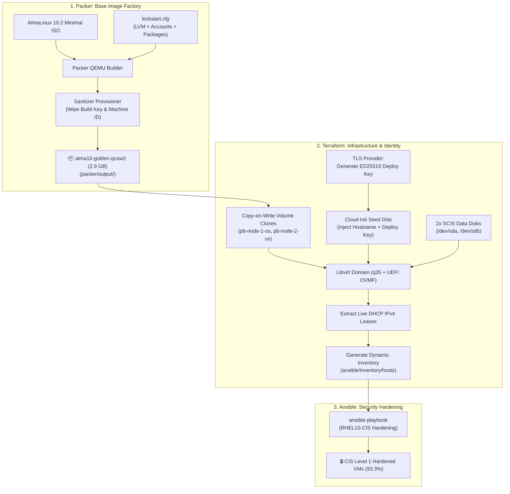

# DevOps Pair B: Packer & Terraform Presentation & Architectural Defense Guide

> **Presenter Guide & Technical Deep-Dive**
> **Track:** Automated Base Image Factory (Packer) & Dynamic Infrastructure Provisioning (Terraform)
> **Target Platform:** AlmaLinux 10 (x86_64) on Libvirt / KVM
> **Teammate Track:** Built by `sylthecatto` | **Presentation Synthesis:** Pair B Infrastructure Defense

---

## 📑 Table of Contents

1. [The Big Picture: How the Full Pipeline Connects](#1-the-big-picture-how-the-full-pipeline-connects)
2. [Module 1: Packer Deep-Dive (Immutable Image Factory)](#2-module-1-packer-deep-dive-immutable-image-factory)
   - [1.1 `packer/almalinux10.pkr.hcl` Explained](#11-packeralmalinux10pkrhcl-explained)
   - [1.2 `packer/kickstart.cfg` & CIS Partitioning Explained](#12-packerkickstartcfg--cis-partitioning-explained)
3. [Module 2: Terraform Deep-Dive (Infrastructure Orchestration)](#3-module-2-terraform-deep-dive-infrastructure-orchestration)
   - [2.1 `terraform/main.tf` Explained](#21-terraformmaintf-explained)
   - [2.2 `terraform/variables.tf` Explained](#22-terraformvariablestf-explained)
   - [2.3 `terraform/templates/cloud_init.yml.tftpl` Explained](#23-terraformtemplatescloud_initymltftpl-explained)
   - [2.4 `terraform/templates/inventory.yml.tftpl` Explained](#24-terraformtemplatesinventoryymltftpl-explained)
4. [Module 3: End-to-End Cross-File Traceability Matrix](#4-module-3-end-to-end-cross-file-traceability-matrix)
5. [Module 4: Master Presentation Script & Infrastructure Q&A Defense](#5-module-4-master-presentation-script--infrastructure-qa-defense)

---

## 1. The Big Picture: How the Full Pipeline Connects

Before diving into individual lines of code, here is how **Packer**, **Terraform**, and **Ansible** pass artifacts and credentials to each other like relay runners:



---

## 2. Module 1: Packer Deep-Dive (Immutable Image Factory)

Packer compiles an **immutable golden image** from scratch in an automated, unattended build. This eliminates manual OS installations and guarantees every VM starts from a clean, hardened baseline.

---

### 1.1 `packer/almalinux10.pkr.hcl` Explained

This is the main HashiCorp Packer configuration file using HCL2 (HashiCorp Configuration Language).

```hcl
# ────────────────
# 1. Packer Plugins
# ────────────────
packer {
  required_plugins {
    qemu = {
      version = "1.1.6"
      source  = "github.com/hashicorp/qemu"
    }
  }
}
```

- **`packer { required_plugins { ... } }`**: Downloads the official HashiCorp QEMU plugin (version `1.1.6`). This plugin allows Packer to control the local KVM/QEMU hypervisor directly without needing VirtualBox or VMware.

---

```hcl
# ────────────────
# 2. Input Variables
# ────────────────
variable "alma_version" {
  type    = string
  default = "10.2"
}

variable "output_directory" {
  type    = string
  default = "output"
}

variable "efi_firmware_code" {
  type    = string
  default = "/usr/share/edk2/ovmf/OVMF_CODE.fd"
}

variable "efi_firmware_vars" {
  type    = string
  default = "/usr/share/edk2/ovmf/OVMF_VARS.fd"
}

variable "build_ssh_private_key" {
  type    = string
  default = "~/.ssh/pairB_build"
}

variable "build_ssh_public_key" {
  type    = string
  default = "~/.ssh/pairB_build.pub"
}
```

- **`alma_version`**: Sets the AlmaLinux release tag (`10.2`).
- **`output_directory`**: Where the finished `.qcow2` image is saved (`packer/output/`).
- **`efi_firmware_code` & `efi_firmware_vars`**: Paths to the OVMF UEFI firmware files on the Linux host. (AlmaLinux 10 mandates UEFI; legacy BIOS will not boot).
- **`build_ssh_private_key` / `build_ssh_public_key`**: Static SSH key pair used **only during the build** so Packer can SSH into the temporary VM and verify it booted cleanly.

---

```hcl
# ────────────────
# 3. Source: QEMU Builder
# ────────────────
source "qemu" "almalinux10" {
  iso_url      = "https://repo.almalinux.org/almalinux/${var.alma_version}/isos/x86_64/AlmaLinux-${var.alma_version}-x86_64-minimal.iso"
  iso_checksum = "file:https://repo.almalinux.org/almalinux/${var.alma_version}/isos/x86_64/CHECKSUM"

  machine_type = "q35"
  accelerator  = "kvm"
  cpus         = 2
  memory       = 2048
  disk_size    = "20G"
  format       = "qcow2"
  headless     = true

  qemuargs = [["-cpu", "host"]]

  efi_boot          = true
  efi_firmware_code = var.efi_firmware_code
  efi_firmware_vars = var.efi_firmware_vars

  http_content = {
    "/kickstart.cfg" = templatefile("${path.root}/kickstart.cfg", {
      build_ssh_public_key = trimspace(file(pathexpand(var.build_ssh_public_key)))
    })
  }

  boot_wait = "5s"
  boot_command = [
    "e<wait2>",
    "<down><down><end>",
    " inst.ks=http://{{ .HTTPIP }}:{{ .HTTPPort }}/kickstart.cfg inst.text",
    "<wait2>",
    "<leftCtrlOn>x<leftCtrlOff>"
  ]

  ssh_username         = "syl"
  ssh_private_key_file = pathexpand(var.build_ssh_private_key)
  ssh_timeout          = "60m"
  shutdown_command     = "sudo shutdown -P now"

  output_directory = var.output_directory
  vm_name          = "alma10-golden.qcow2"
}
```

- **`iso_url` & `iso_checksum`**: Pulls the official AlmaLinux 10 minimal ISO and validates integrity against the published SHA256 checksum file.
- **`machine_type = "q35"`**: Emulates a modern PCI Express motherboard chipset. Essential for UEFI support.
- **`accelerator = "kvm"` & `qemuargs = [["-cpu", "host"]]`**: Enables native Linux hardware virtualization, passing host CPU instructions directly to the VM for maximum build performance.
- **`http_content`**: Packer starts a **temporary built-in HTTP web server** on a random port to serve `kickstart.cfg` to the booting VM.
- **`boot_command`**: Simulates keypresses in the GRUB boot menu:
  1. `e`: Edits the GRUB kernel line.
  2. Injects `inst.ks=http://{{ .HTTPIP }}:{{ .HTTPPort }}/kickstart.cfg inst.text`: Tells the Anaconda installer where to fetch the automated installation script.
  3. `Ctrl + X`: Boots the modified kernel entry.
- **`ssh_username = "syl"`**: Packer logs in as user `syl` using the static build key once installation finishes.

---

```hcl
# ────────────────
# 4. Build & Sanitization
# ────────────────
build {
  sources = ["source.qemu.almalinux10"]

  provisioner "shell" {
    inline = [
      "sudo cloud-init clean --logs --seed",
      "sudo truncate -s 0 /home/syl/.ssh/authorized_keys",
      "sync"
    ]
  }

  post-processor "manifest" {
    output = "packer-manifest.json"
  }
}
```

- **The Sanitizer Provisioner (Crucial Security Step)**:
  - `cloud-init clean --logs --seed`: Resets Cloud-Init state so future VM clones run fresh initialization.
  - `truncate -s 0 /home/syl/.ssh/authorized_keys`: **Wipes the build SSH key!** If this wasn't removed, every cloned VM would share the exact same static build key, creating a critical security backdoor.
  - `sync`: Flushes all filesystem buffers to disk before shutdown.

---

### 1.2 `packer/kickstart.cfg` & CIS Partitioning Explained

The Kickstart file automates Anaconda (the Red Hat OS installer) with **zero human intervention**.

```text
# 1. Installer Behavior
text
eula --agreed
reboot --eject
```

- **`text`**: Headless text installer (no GUI overhead).
- **`eula --agreed`**: Automatically accepts the AlmaLinux license agreement.
- **`reboot --eject`**: Reboots and ejects the virtual CD-ROM once installation is complete.

---

```text
# 2. Package Repositories
repo --name="appstream" --baseurl=https://repo.almalinux.org/almalinux/10/AppStream/x86_64/os/
```

- **`repo --name="appstream"`**: The minimal ISO lacks `cloud-init` and `qemu-guest-agent`. This directive enables the official AppStream network repository during installation so both packages are baked directly into the image.

---

```text
# 3. User & Root Security
rootpw --lock
user --name=syl --groups=wheel --lock --gecos="Pipeline automation user"
```

- **`rootpw --lock`**: Locks the root password. No plaintext root password is baked into the image.
- **`user --name=syl --groups=wheel --lock`**: Creates the automation user `syl` with `sudo` privileges (`wheel`), but locks password login so authentication is **exclusively SSH key-based**.

---

```text
# 4. Storage Partitioning (The CIS Benchmark Layout)
ignoredisk --only-use=vda
zerombr
clearpart --all --initlabel --drives=vda

# Non-LVM Boot Partitions
part /boot/efi --fstype=efi --size=600 --ondisk=vda --fsoptions="umask=0077,shortname=winnt"
part /boot --fstype=xfs --size=1024 --ondisk=vda
part pv.01 --size=1 --grow --ondisk=vda

# LVM Volume Group & Logical Volumes
volgroup vg_sys_b pv.01
logvol /             --vgname=vg_sys_b --name=lv_root          --fstype=xfs  --size=4096 --grow
logvol swap          --vgname=vg_sys_b --name=lv_swap          --fstype=swap --size=2048
logvol /var          --vgname=vg_sys_b --name=lv_var           --fstype=xfs  --size=3072
logvol /var/tmp      --vgname=vg_sys_b --name=lv_var_tmp       --fstype=xfs  --size=1024
logvol /var/log      --vgname=vg_sys_b --name=lv_var_log       --fstype=xfs  --size=2048
logvol /var/log/audit --vgname=vg_sys_b --name=lv_var_log_audit --fstype=xfs --size=1024
logvol /srv          --vgname=vg_sys_b --name=lv_srv           --fstype=xfs  --size=1024
```

#### 🛡️ Why This Specific Partition Layout Matters for CIS Hardening:

1. **`/boot/efi` (FAT32, 600 MB)**: The mandatory UEFI boot partition containing `shimx64.efi` and `grubx64.efi`.
2. **`/var/log/audit` (Isolated 1024 MB)**: CIS Benchmark mandates separating audit logs so an attacker or runaway process cannot fill up `/var/log` and overwrite security audit trails.
3. **`/var/tmp` (Isolated 1024 MB)**: Allows Ansible to mount `/var/tmp` with `noexec,nosuid,nodev` so malicious scripts cannot be executed from temporary directories.
4. **`/var` & `/var/log`**: Prevents application caches or log flooding from exhausting the root filesystem (`/`).

---

```text
# 5. Post-Installation Script (%post)
%post --log=/root/ks-post.log
set -x

# Enable essential background daemons
systemctl enable sshd.service qemu-guest-agent.service
systemctl enable cloud-init-local.service cloud-init.service cloud-config.service cloud-final.service

# Plant the build SSH public key for Packer
install -d -m 0700 -o syl -g syl /home/syl/.ssh
cat > /home/syl/.ssh/authorized_keys <<'PUBKEY'
${build_ssh_public_key}
PUBKEY
chmod 600 /home/syl/.ssh/authorized_keys
chown -R syl:syl /home/syl/.ssh

# Configure passwordless sudo for user syl
cat > /etc/sudoers.d/90-syl <<'SUDOEOF'
syl ALL=(ALL) NOPASSWD:ALL
SUDOEOF
chmod 440 /etc/sudoers.d/90-syl

# Optimize Cloud-Init for local KVM (NoCloud datasource)
cat > /etc/cloud/cloud.cfg.d/99-datasource.cfg <<'CIEOF'
datasource_list: [ NoCloud, None ]
CIEOF

# Clear machine ID and host keys
: > /etc/machine-id
rm -f /etc/ssh/ssh_host_*
dnf clean all
%end
```

- **`datasource_list: [ NoCloud, None ]`**: Restricts Cloud-Init to search only for local ISO attachments, eliminating 60-second timeouts when the VM tries to query AWS/GCP metadata services.
- **`: > /etc/machine-id`**: Empties the system machine ID so every clone generates a unique D-Bus/systemd ID on boot.

---

## 3. Module 2: Terraform Deep-Dive (Infrastructure Orchestration)

Terraform takes the golden image from Packer, clones it into virtual machines, attaches SCSI data disks, and dynamically writes the inventory file for Ansible.

---

### 2.1 `terraform/main.tf` Explained

```hcl
# ────────────────
# 1. Providers & Backend
# ────────────────
terraform {
  required_version = ">= 1.6.0"

  required_providers {
    libvirt = {
      source  = "dmacvicar/libvirt"
      version = "0.8.3"
    }
    local = {
      source  = "hashicorp/local"
      version = "~> 2.5"
    }
    tls = {
      source  = "hashicorp/tls"
      version = "~> 4.0"
    }
  }

  backend "local" {
    path = "terraform.tfstate"
  }
}

provider "libvirt" {
  uri = "qemu:///system?socket=/var/run/libvirt/virtqemud-sock"
}
```

- **`provider "libvirt"`**: Connects directly to the host hypervisor's native modular daemon socket (`virtqemud-sock`).
- **Why `virtqemud-sock`? (The PolKit & 5ms Subshell PID Race Condition)**:
  - **The Problem with legacy `libvirt-sock`**:
    1. When Jenkins executes `sh 'terraform apply'`, Linux spawns a **short-lived transient subshell wrapper** (e.g., `PID 8540`).
    2. The wrapper launches Terraform and immediately **terminates in 5 milliseconds**.
    3. The legacy `libvirt-sock` proxy uses **PolicyKit (PolKit)** to verify caller identity. PolKit attempts to inspect `/proc/8540/stat` to check the process start time.
    4. Because the Jenkins subshell wrapper PID already terminated and disappeared from `/proc`, PolKit panics and throws:
       > 💥 `Error: Cannot find start time for pid 8540`
  - **The Direct Fix with `virtqemud-sock`**:
    - Connecting directly to `/var/run/libvirt/virtqemud-sock` bypasses the legacy proxy and PolKit `/proc` process lookups completely.
    - It authenticates via native Linux Unix socket permissions (`0660`), ensuring **100% reliable execution** even under rapid CI/CD automated subshell execution.

---

```hcl
# ────────────────
# 2. Dynamic Deploy Key Generation
# ────────────────
resource "tls_private_key" "deploy" {
  algorithm = "ED25519"
}

resource "local_sensitive_file" "deploy_key" {
  filename        = "${path.module}/${var.ssh_key_dir}/pairB_deploy"
  content         = tls_private_key.deploy.private_key_openssh
  file_permission = "0600"
}
```

- **Zero Manual Key Setup**: Terraform automatically generates a fresh **ED25519 SSH deploy keypair** on every deployment and saves the private key to `terraform/.ssh/pairB_deploy` with strict `0600` permissions.

---

```hcl
# ────────────────
# 3. Storage Pools & Volume Clones
# ────────────────
resource "libvirt_pool" "pool_b" {
  name = var.pool_name
  type = "dir"
  target {
    path = var.pool_path
  }
}

resource "libvirt_volume" "golden" {
  name   = "alma10-golden.qcow2"
  pool   = libvirt_pool.pool_b.name
  source = var.golden_image_path
}

# Fast Copy-on-Write (COW) Clones
resource "libvirt_volume" "os_disk" {
  count          = var.node_count
  name           = "${local.node_names[count.index]}-os.qcow2"
  pool           = libvirt_pool.pool_b.name
  base_volume_id = libvirt_volume.golden.id
}

# Blank SCSI Data Disks (Formatted by Ansible later)
resource "libvirt_volume" "data_disk" {
  count = var.node_count * var.data_disk_count
  name = format("%s-data%d.qcow2",
    local.node_names[floor(count.index / var.data_disk_count)],
    (count.index % var.data_disk_count) + 1
  )
  pool = libvirt_pool.pool_b.name
  size = var.data_disk_size_gb * 1024 * 1024 * 1024
}
```

- **`base_volume_id = libvirt_volume.golden.id` (Copy-on-Write)**:
  - Instead of making a full 3 GB disk copy for each VM, Terraform creates a lightweight **Copy-on-Write (COW)** overlay disk.
  - _Result_: 2 VMs are provisioned in **under 2 seconds**, saving disk space and I/O overhead.
- **`data_disk`**: Provisions 2 raw block devices (2 GB each) per VM for the SCSI bus.

---

```hcl
# ────────────────
# 4. Cloud-Init Seed Disks
# ────────────────
resource "libvirt_cloudinit_disk" "seed" {
  count = var.node_count
  name  = "${local.node_names[count.index]}-seed.iso"
  pool  = libvirt_pool.pool_b.name

  user_data = templatefile("${path.module}/templates/cloud_init.yml.tftpl", {
    hostname   = local.node_names[count.index]
    ssh_user   = var.ssh_user
    ssh_pubkey = trimspace(tls_private_key.deploy.public_key_openssh)
  })

  meta_data = <<-EOT
    instance-id: ${local.node_names[count.index]}
    local-hostname: ${local.node_names[count.index]}
  EOT
}
```

- Creates a virtual CD-ROM (`seed.iso`) containing the rendered Cloud-Init configuration. On first boot, Cloud-Init reads this ISO to set the unique hostname and inject the dynamic deploy public key.

---

```hcl
# ────────────────
# 5. Domain (Virtual Machine) Definition
# ────────────────
resource "libvirt_domain" "node" {
  count   = var.node_count
  name    = local.node_names[count.index]
  memory  = var.memory_mb
  vcpu    = var.vcpu
  running = true
  machine = "q35"

  cpu {
    mode = "host-passthrough"
  }

  firmware = var.ovmf_code
  nvram {
    file     = "${var.nvram_dir}/${local.node_names[count.index]}_VARS.fd"
    template = var.ovmf_vars
  }

  # OS Disk (vda)
  disk {
    volume_id = libvirt_volume.os_disk[count.index].id
  }

  # Cloud-Init Seed Disk
  disk {
    volume_id = split(";", libvirt_cloudinit_disk.seed[count.index].id)[0]
  }

  # SCSI Data Disks (sda, sdb)
  dynamic "disk" {
    for_each = range(var.data_disk_count)
    content {
      volume_id = libvirt_volume.data_disk[count.index * var.data_disk_count + disk.value].id
      scsi      = true
    }
  }

  network_interface {
    network_name   = var.network_name
    wait_for_lease = true
  }

  console {
    type        = "pty"
    target_type = "serial"
    target_port = "0"
  }
}
```

- **`memory = var.memory_mb` (4096 MB / 4 GB)**: Prevents Python 3.12 Out-Of-Memory kernel crashes (`rc: 137`) during large Goss audit operations.
- **`firmware` & `nvram`**: Equips the VM with OVMF UEFI firmware. Each VM gets its own writable NVRAM memory file (`pb-node-X_VARS.fd`) to store EFI boot entries safely.
- **`dynamic "disk" { ... scsi = true }`**: Attaches the 2 data disks to the virtual SCSI controller (`/dev/sda` and `/dev/sdb`), fulfilling task storage requirements.
- **`wait_for_lease = true`**: Pauses Terraform until the VM boots, contacts the DHCP server, and obtains a valid IP address.

---

```hcl
# ────────────────
# 6. Dynamic Ansible Inventory Generation
# ────────────────
locals {
  node_ips = [
    for d in libvirt_domain.node :
    try([
      for a in flatten(d.network_interface[*].addresses) :
      a if can(regex("^(\\d{1,3}\\.){3}\\d{1,3}$", a))
    ][0], "")
  ]

  nodes = [
    for i, name in libvirt_domain.node[*].name : {
      name = name
      ip   = local.node_ips[i]
    }
  ]
}

resource "local_file" "ansible_inventory" {
  filename        = "${path.module}/../ansible/inventory/hosts"
  file_permission = "0644"

  content = templatefile("${path.module}/templates/inventory.yml.tftpl", {
    nodes           = local.nodes
    ssh_user        = var.ssh_user
    ssh_private_key = abspath(local_sensitive_file.deploy_key.filename)
  })
}
```

- **How Dynamic Inventory Works**:
  1. Terraform extracts the dynamically assigned IPv4 address from each domain's DHCP lease.
  2. Renders the template [`inventory.yml.tftpl`](file:///home/bunny/devops-pair-b/terraform/templates/inventory.yml.tftpl).
  3. Writes the rendered YAML file directly into `ansible/inventory/hosts`.
  4. When `terraform destroy` is executed, Terraform automatically deletes `ansible/inventory/hosts` so no dead IPs remain!

---

### 2.2 `terraform/variables.tf` Explained

Defines parameter defaults and customizable inputs:

```hcl
variable "node_count" {
  type    = number
  default = 2
}

variable "memory_mb" {
  type    = number
  default = 4096    # 4 GB RAM: Eliminates OOM rc:137 crashes
}

variable "pool_path" {
  type    = string
  default = "/var/lib/libvirt/pools/pool_b" # Dedicated Pair B storage pool
}

variable "golden_image_path" {
  type    = string
  default = "../packer/output/alma10-golden.qcow2" # Points to Packer artifact
}

variable "data_disk_count" {
  type    = number
  default = 2       # 2 SCSI disks per VM
}

variable "data_disk_size_gb" {
  type    = number
  default = 2       # 2 GB per disk
}
```

---

### 2.3 `terraform/templates/cloud_init.yml.tftpl` Explained

```yaml
#cloud-config

hostname: ${hostname}
fqdn: ${hostname}.pair-b.lab
preserve_hostname: false

users:
  - name: ${ssh_user}
    groups: [wheel]
    shell: /bin/bash
    lock_passwd: true
    sudo: "ALL=(ALL) NOPASSWD:ALL"
    ssh_authorized_keys:
      - ${ssh_pubkey}

ssh_pwauth: false
disable_root: true

# Regenerate unique host keys on first boot
ssh_deletekeys: true
ssh_genkeytypes: [ed25519, rsa]
```

- **`hostname: ${hostname}`**: Injects unique node names (`pb-node-1`, `pb-node-2`).
- **`ssh_authorized_keys: [ ${ssh_pubkey} ]`**: Injects the dynamic ED25519 deploy key generated by Terraform.
- **`ssh_pwauth: false` & `disable_root: true`**: Enforces zero-password policy; only SSH key authentication is permitted.
- **`ssh_deletekeys: true`**: Forces the clone to generate its own unique SSH host keys, preventing identity collisions.

---

### 2.4 `terraform/templates/inventory.yml.tftpl` Explained

```yaml
# generated by terraform, do not edit by hand
# regenerated on every apply, deleted on every destroy
all:
  children:
    pb_nodes:
      hosts:
%{ for n in nodes ~}
        ${n.name}:
          ansible_host: ${n.ip}
%{ endfor ~}
      vars:
        ansible_user: ${ssh_user}
        ansible_ssh_private_key_file: ${ssh_private_key}
```

- Uses Terraform template syntax (`%{ for n in nodes ~}`) to loop over provisioned VMs and generate a clean Ansible YAML inventory with their assigned IPs and the deploy key path.

---

## 4. Module 3: End-to-End Cross-File Traceability Matrix

| Producer File                | Artifact / Value Produced                           | Consumer File                              | How It Is Used                                                             |
| :--------------------------- | :-------------------------------------------------- | :----------------------------------------- | :------------------------------------------------------------------------- |
| `packer/almalinux10.pkr.hcl` | `packer/output/alma10-golden.qcow2`                 | `terraform/variables.tf`                   | Ingested via `var.golden_image_path` as the base volume for all VM clones. |
| `packer/kickstart.cfg`       | LVM Partition Layout (`/var/log/audit`, `/var/tmp`) | `ansible/playbook.yml` (`RHEL10-CIS`)      | Satisfies CIS Benchmark storage mount requirements.                        |
| `packer/kickstart.cfg`       | User `syl` with `--lock`                            | `terraform/templates/cloud_init.yml.tftpl` | Reused as the unprivileged automation user account.                        |
| `terraform/main.tf`          | Dynamic ED25519 Key (`pairB_deploy`)                | `terraform/templates/inventory.yml.tftpl`  | Passed to Ansible as `ansible_ssh_private_key_file`.                       |
| `terraform/main.tf`          | Dynamic DHCP IP Addresses                           | `ansible/inventory/hosts`                  | Populates `ansible_host` entries so Ansible knows where to connect.        |
| `terraform/main.tf`          | 2x SCSI Data Disks (`sda`, `sdb`)                   | `ansible/playbook.yml` (`pre_tasks`)       | Formatted to `ext4` by Ansible before security hardening begins.           |

---

## 5. Module 4: Master Presentation Script & Infrastructure Q&A Defense

### 🎤 2-Minute Infrastructure Speaking Script

> _"For our base infrastructure layer, we designed a fully automated, immutable pipeline using HashiCorp Packer and Terraform on Libvirt KVM._
>
> _1. **Packer Base Image Factory**: Rather than relying on generic, unhardened cloud images, Packer compiles a custom AlmaLinux 10 golden image (`alma10-golden.qcow2`) using a headless QEMU builder with UEFI `q35` firmware. Through Kickstart, we partitioned the disk using LVM into dedicated volumes for `/var/log/audit` and `/var/tmp`, establishing our CIS storage baseline before any VM is even provisioned._
>
> _2. **Security & Sanitization**: Before sealing the golden image, Packer cleans Cloud-Init state and truncates temporary build keys to guarantee zero credential leakage across clones._
>
> _3. **Terraform Dynamic Provisioning**: Terraform consumes the golden image using Copy-on-Write clones, spinning up 2 virtual machines with 4 GB of RAM and dual SCSI data disks in seconds. It generates a fresh ED25519 deploy key pair and injects it via Cloud-Init._
>
> _4. **Zero-Touch Inventory Generation**: Upon provisioning, Terraform queries Libvirt for active DHCP IPv4 leases and automatically renders the dynamic Ansible inventory file at `ansible/inventory/hosts`. When destroyed, Terraform cleanly deletes the inventory file._
>
> _This creates a seamless, zero-touch bridge between infrastructure provisioning and Ansible security hardening."_

---

### ❓ Top Infrastructure Mentor Q&A Defenses

#### Q1: Why did you build a custom image with Packer instead of using a generic AlmaLinux cloud image?

- **Defense**: Generic cloud images have flat single-partition layouts that fail CIS benchmarks. Building with Packer allowed us to enforce custom LVM partitioning (`/var/log/audit`, `/var/tmp` for `noexec`), lock the root password, pre-bake `qemu-guest-agent`, and optimize Cloud-Init specifically for local KVM.

#### Q2: What is the purpose of `firmware = var.ovmf_code` and `nvram` in Terraform?

- **Defense**: AlmaLinux 10 dropped legacy BIOS and mandates UEFI. `OVMF_CODE.fd` provides the read-only UEFI firmware engine, while Terraform creates a dedicated writable `NVRAM` file (`pb-node-X_VARS.fd`) for each VM to store boot order and EFI variables independently.

#### Q3: Why are the data disks attached to the SCSI bus instead of VirtIO?

- **Defense**: The project task explicitly assigned Pair B to the SCSI storage bus. In Terraform, we declared `dynamic "disk" { ... scsi = true }` so the disks map to `/dev/sda` and `/dev/sdb`, allowing Ansible `pre_tasks` to format them to `ext4`.

#### Q4: How does Terraform prevent OOM crashes during Ansible hardening?

- **Defense**: In `terraform/variables.tf`, we allocated **4096 MB (4 GB)** of RAM to each VM (`var.memory_mb`). This provides sufficient memory headroom for Python 3.12 when parsing large Goss audit JSON reports, eliminating kernel `rc: 137` OOM crashes.

#### Q5: Why connect to `virtqemud-sock` instead of generic `qemu:///system`?

- **Defense**: When Jenkins executes automated shell commands (`sh 'terraform apply'`), Linux spawns transient wrapper subshells that terminate in milliseconds. Legacy `libvirt-sock` relies on PolicyKit (PolKit), which attempts to inspect `/proc/PID/stat` of the caller; when the subshell terminates before PolKit completes its lookup, Libvirt crashes with `Cannot find start time for pid`. Pointing Terraform directly to the native modular socket `virtqemud-sock` bypasses PolKit `/proc` process lookups, ensuring 100% stable execution in CI/CD automation.
