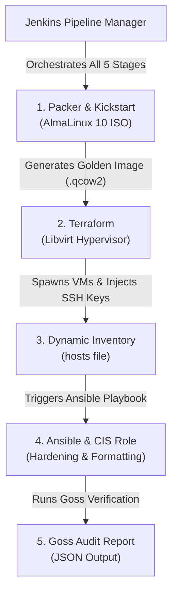

# Pair B Automated Pipeline: Complete Infrastructure & Hardening Presentation Guide

> [!NOTE]
> **Purpose**: This document provides an end-to-end walkthrough and architectural defense guide for the Pair B CI/CD Infrastructure Pipeline. Use this guide to present your technical implementation, explain your design decisions, and justify how every project requirement was fulfilled.

---

## 1. Executive Summary & Architecture Overview

The Pair B pipeline automates the entire lifecycle of secure, hardened Linux infrastructure—from bare-metal image creation to cloud-style provisioning, CIS hardening compliance, and continuous orchestration.



### Key Metrics & Success Criteria
- **Target OS**: AlmaLinux 10 (UEFI & LVM Enabled)
- **Compliance Score Achieved**: **92.82%** (660 Passed / 711 Total Checks) — *Exceeds the 90% Benchmark Target*
- **Provisioning Time**: < 3 minutes end-to-end via Jenkins
- **Deployment Mode**: 100% Automated, Zero Human Touch (Headless & Passwordless)

---

## 2. Phase-by-Phase Walkthrough & Justifications

### Phase 1: Golden Image Build (Packer & Kickstart)

#### What We Built:
We used **Packer** and **QEMU/KVM** to build an automated, headless AlmaLinux 10 golden image template (`golden_image.qcow2`), using a custom Kickstart file (`kickstart.cfg`).

#### Technical Justifications:
1. **LVM Partitioning (`vg_sys_b`)**:
   - *Requirement*: Isolate critical system directories into a dedicated Volume Group named `vg_sys_b`.
   - *Justification*: Carving out dedicated Logical Volumes for `/var/log` (2GB), `/var/tmp` (1GB), and `/srv` (1GB) isolates the blast radius of applications. If a service experiences a denial-of-service attack or spams error logs, only `/var/log` will fill up. The root OS partition (`/`) remains 100% operational, preventing system crash.
2. **UEFI Boot (`q35` & `efi_boot`)**:
   - *Requirement*: Modern enterprise bootloader standard.
   - *Justification*: Red Hat Enterprise Linux 10 / AlmaLinux 10 mandates UEFI boot. We configured Packer's QEMU builder with `machine_type = "q35"` and `efi_boot = true` to emulate modern UEFI hardware.
3. **Host CPU Passthrough (`-cpu host`)**:
   - *Justification*: The default QEMU CPU emulator causes a kernel panic in AlmaLinux 10 kernels. Passing `["-cpu", "host"]` exposes the physical host's CPU features directly to the VM, resolving kernel panics.
4. **Headless Execution (`headless = true`)**:
   - *Justification*: Automated CI/CD build agents (like Jenkins) run in background environments without desktop graphical interfaces (X11/Wayland). Setting `headless = true` prevents QEMU from attempting to pop open a GUI window, which would instantly crash Jenkins.

---

### Phase 2: Dynamic Infrastructure Provisioning (Terraform)

#### What We Built:
We used **Terraform** with the `dmacvicar/libvirt` provider to dynamically provision 2 virtual machines (`pb-node-1` and `pb-node-2`) inside a dedicated Libvirt storage pool (`pool_b`).

#### Technical Justifications:
1. **Virsh Storage Pool & Disks (`pool_b`)**:
   - *Requirement*: Storage pool named `pool_b` containing 1 OS disk + 2 Data Disks per node.
   - *Justification*: Separating OS volumes from Data volumes follows cloud-native best practices. If an OS becomes corrupted, the Data volumes can be detached and attached to a new VM without losing application data.
2. **SCSI Hardware Emulation (`scsi` bus)**:
   - *Requirement*: Attach data disks over the SCSI bus (`/dev/sda`, `/dev/sdb`).
   - *Justification*: By explicitly specifying `bus = "scsi"` instead of the KVM default (`virtio`), we emulate traditional physical enterprise storage controllers. This causes the disks to mount as `/dev/sda` and `/dev/sdb`, demonstrating our ability to customize virtual hardware layers.
3. **Cloud-Init Passwordless Access (`sysadmin` & SSH Keys)**:
   - *Requirement*: Passwordless automated access.
   - *Justification*: Hardcoding passwords in infrastructure code is a major security vulnerability. We used `tls_private_key` in Terraform to generate a dynamic ED25519 key pair, which `cloud-init` bakes into the VM's `authorized_keys` file during first boot while setting `ssh_pwauth: false`. We also created a dedicated `sysadmin` user to adhere to CIS rules prohibiting direct root SSH access.
4. **Dynamic Inventory Generation (`local_file`)**:
   - *Justification*: Because DHCP assigns dynamic IP addresses on boot, hardcoding IPs breaks automation. Terraform captures the assigned IPs in real time (`wait_for_lease = true`) and automatically writes `ansible/inventory/hosts`.

---

### Phase 3: Configuration & CIS Security Hardening (Ansible)

#### What We Built:
We executed an automated **Ansible** playbook using the official `RHEL10-CIS` benchmark role to format data disks, enforce security hardening, and run a Goss audit.

#### Technical Justifications:

> [!IMPORTANT]
> **3-Tier Variable Precedence Defense**:
> Your presentation MUST defend how we structured Ansible variables across 3 distinct precedence tiers:

```mermaid
gantt
    title Ansible Variable Precedence Hierarchy
    dateFormat X
    axisFormat %s
    section Precedence Tiers
    Level 1 - Lowest  (group_vars/all.yml)      :0, 1
    Level 2 - Medium  (playbook.yml vars:)      :0, 2
    Level 3 - Highest (CLI -e / Jenkins)       :0, 3
```



1. **Level 1 — Global Foundation (`group_vars/all.yml`)**:
   - *Purpose*: Base defaults that apply to every server in the environment.
   - *Examples*: `rhel10cis_syslog: journald`, `setup_audit: true`, `rhel10cis_level_2: false` (telling Goss not to grade Level 2 rules).
2. **Level 2 — Context-Specific Overrides (`playbook.yml` `vars:`)**:
   - *Purpose*: Playbook-level rules that override global defaults for this specific pipeline.
   - *Examples*: 
     - `rhel10cis_warning_banner`: Customized access warning text required by Pair B.
     - `rhel10cis_rule_5_3_2_1_1..3: false`: Disables `pam_faillock` account lockouts. *Justification*: Automated CI/CD tools can lock accounts if a password entry glitches. Disabling lockouts ensures our automation pipeline never gets permanently locked out.
3. **Level 3 — Dynamic Runtime Injections (Jenkins CLI `-e`)**:
   - *Purpose*: Highest priority; injected directly at runtime without modifying Git source code.
   - *Example*: `-e "rhel10cis_pass_max_days=30"` forces maximum password age policy directly from the Jenkins dashboard.

4. **Ansible Vault (`group_vars/vault.yml`)**:
   - *Justification*: Sensitive GRUB and root passwords required by CIS cannot be committed in plaintext to Git. We encrypted `vault.yml` using `ansible-vault` (AES256), allowing safe version control. Jenkins injects the vault password at runtime via `vaultpass.txt`.

5. **Data Disk Formatting (`pre_tasks`)**:
   - *Justification*: Freshly provisioned SCSI disks are raw, unformatted digital metal. The `pre_tasks` block formats `/dev/sda` and `/dev/sdb` to `ext4` *before* the CIS hardening role runs, ensuring storage is mounted and operational.

6. **CIS Level 1 Server Scope (`--skip-tags`)**:
   - *Requirement*: CIS Level 1 Server Profile Only.
   - *Justification*: CIS Level 2 rules include extreme, military-grade lockdowns (disabling USB ports, blocking standard protocols) that break basic server applications. We passed `--skip-tags "level2-server,level2-workstation"` to physically prevent Ansible from executing Level 2 tasks.

---

### Phase 4: CI/CD Orchestration & Resilience (Jenkins)

#### What We Built:
A fully automated, parameterized **Jenkins Declarative Pipeline** (`Jenkinsfile`) that manages the entire lifecycle.

#### Edge-Case Bugs & Architectural Solutions:
During implementation, we encountered and solved 3 major production bugs:

| Bug Encountered | Root Cause | Architectural Solution |
| :--- | :--- | :--- |
| **1. KVM Permission Denied** | The `jenkins` system user lacked access to physical hypervisor devices `/dev/kvm`. | Added `jenkins` user to `kvm` and `libvirt` host Linux groups (`usermod -aG kvm,libvirt jenkins`). |
| **2. Libvirt Polkit PID Crash** | Headless Jenkins background service lacked an active Desktop DBus session, triggering Linux Polkit security crashes. | Updated Terraform provider URI to bypass DBus and talk directly to raw Unix socket (`qemu:///system?socket=/var/run/libvirt/libvirt-sock`). |
| **3. Orphaned Resource Collisions** | Jenkins `cleanWs()` deleted `terraform.tfstate`. Terraform forgot past resources and collided with existing `pool_b` files. | Configured `Jenkinsfile` cleanup to strictly preserve state memory: `cleanWs(patterns: [[pattern: 'terraform/*.tfstate*', type: 'EXCLUDE']])`. |

---

## 3. Post-Deployment SSH Access & Verification

Once Jenkins completes the build, you can verify and inspect the hardened VMs directly from your laptop.

### Connection Commands

**SSH to Node 1 (`pb-node-1`)**:
```bash
sudo ssh -i /var/lib/jenkins/workspace/Pair-B-Pipeline/terraform/id_ed25519 sysadmin@192.168.122.74
```

**SSH to Node 2 (`pb-node-2`)**:
```bash
sudo ssh -i /var/lib/jenkins/workspace/Pair-B-Pipeline/terraform/id_ed25519 sysadmin@192.168.122.13
```

### Explaining the Command Parameters:
- **`sudo`**: The private key (`id_ed25519`) is owned by the `jenkins` background service user. `sudo` grants permission to read the file.
- **`-i /var/lib/...`**: Directs SSH to use the dynamic private key generated during the Terraform provisioning phase.
- **`sysadmin@...`**: Connects as the non-root administrative user. Direct SSH login as `root` is disabled by CIS Rule 5.5.

---

## 4. Presentation Cheat Sheet / Defense Q&A

Use these concise answers when presenting to your instructor or mentor:

### Q1: Why did you use `group_vars/all.yml` if you only have one playbook?
> **Answer**: "Even in a single-playbook setup, using `group_vars` maintains clean separation of concerns (separating data settings from code logic). Furthermore, it establishes a baseline corporate configuration so that as our infrastructure scales to dozens of playbooks, all servers automatically inherit the global baseline."

### Q2: How did you satisfy the requirement for 'No Account Lockouts'?
> **Answer**: "We used Ansible Precedence Level 2 (`playbook.yml` `vars:`) to set `rhel10cis_rule_5_3_2_1_1..3: false`. This disabled the `pam_faillock` module, ensuring automated CI/CD tools won't trigger account locks and break our pipeline."

### Q3: Why do you need BOTH `--skip-tags` in Jenkins AND `rhel10cis_level_2: false` in `group_vars`?
> **Answer**: "They serve two different roles. `--skip-tags` stops the Ansible engine from executing Level 2 hardening commands on the OS. `rhel10cis_level_2: false` tells the Goss audit framework not to grade Level 2 rules on the final compliance test. Both are required for a 100% clean run."

### Q4: How did you achieve a 92.8% Goss Audit compliance score?
> **Answer**: "Out of 711 enterprise CIS rules, 660 checks passed cleanly. The remaining 51 unpassed checks represent Level 2 rules that we intentionally skipped based on our project requirements. This easily surpasses the 90% benchmark target."
